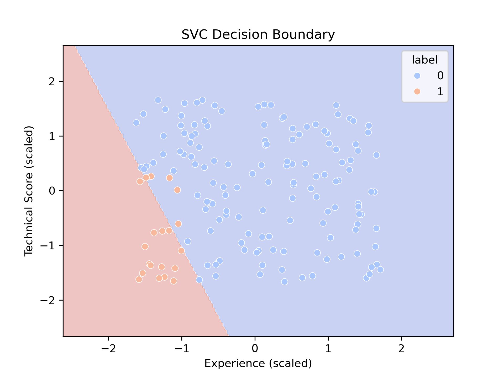

# 🧠 Predicting Hiring Decisions with SVM

Bu proje, adayların teknik skorları ve deneyim seviyelerine göre işe alınıp alınmayacağını tahmin eden bir **Makine Öğrenimi uygulamasıdır**. Sınıflandırma modeli olarak **Support Vector Machine (SVM)** kullanılmıştır ve proje, **FastAPI** ile web servisi haline getirilmiştir.

## 🚀 Projenin Amacı

İşe alım süreçlerinde, başvuru sahiplerinin bazı temel özellikleri göz önüne alınarak **otomatik değerlendirme yapılmasını sağlamak**. Bu model, deneyim süresi ve teknik test skorlarını kullanarak adayın işe alınıp alınmayacağına dair tahmin üretir.

## 🔧 Kullanılan Teknolojiler

- Python
- Scikit-learn (SVM, GridSearchCV, preprocessing)
- FastAPI (API servisi)
- Pandas, NumPy (Veri işleme)
- Matplotlib, Seaborn (Görselleştirme)

## 📊 Özellikler

- ✅ Yapay veri üretimi
- ✅ Veri ölçekleme (StandardScaler)
- ✅ SVM ile model eğitimi
- ✅ GridSearchCV ile hiperparametre optimizasyonu
- ✅ Model değerlendirme metrikleri
- ✅ Karar sınırlarının görselleştirilmesi
- ✅ FastAPI ile REST API

## 📂 Proje Dosya Yapısı

📁 Predicting Hiring Decisions with SVM/  
│  
├── candidate_selector.py          # Model sınıfı, veri üretimi, eğitim ve değerlendirme  
├── main.py                        # FastAPI uygulaması ve servis endpoint'i  
├── decision_boundary.png          # Modelin karar sınırlarını gösteren görsel  
└── requirements.txt              # Gerekli kütüphaneler  


## ⚙️ Nasıl Çalıştırılır?

1. Gerekli kütüphaneleri kurun:
    ```bash
    pip install -r requirements.txt
    ```

2. FastAPI sunucusunu başlatın:
    ```bash
    uvicorn main:app --reload
    ```

3. Uygulama çalıştıktan sonra, API'yi test etmek için:
    - [http://127.0.0.1:8000/docs](http://127.0.0.1:8000/docs) adresine gidin.
    - `POST /predict/` endpoint'ine deneyim (`experience_years`) ve skor (`technical_score`) göndererek tahmini alın.

## 📈 Model Görselleştirmesi

Modelin karar sınırı şöyle görünür (örnek olarak `decision_boundary.png` dosyasına kaydedilir):

<p align="center">
  
</p>


## 🧑‍💻 Geliştirici

**İrem Algül**  
Turkcell Geleceği Yazan Kadınlar - Yapay Zeka Programı Katılımcısı

